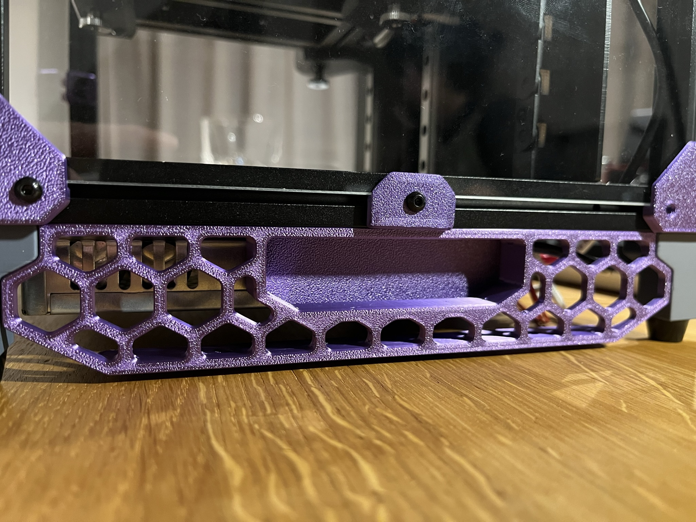
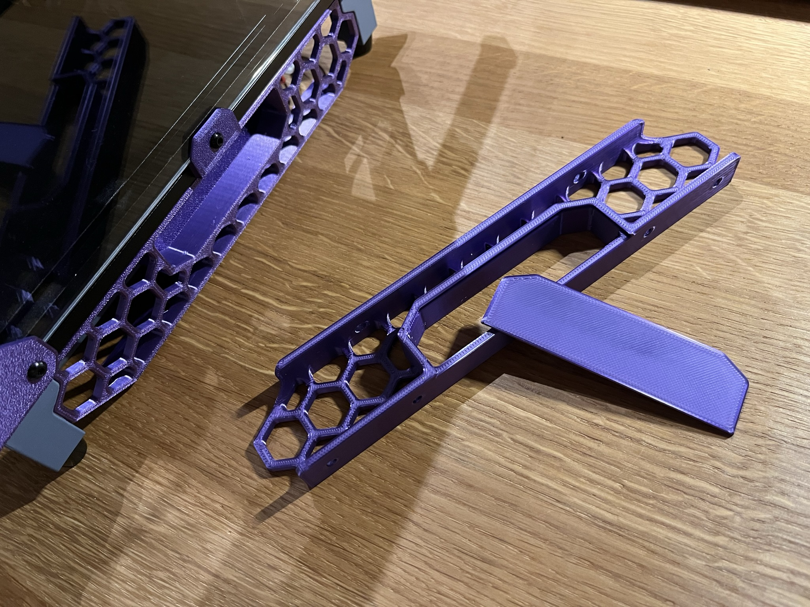
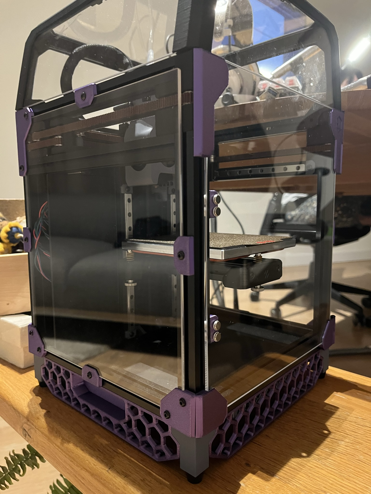

# Voron v0.1 mods

Modifications for the Voron v0.1 3D printer

## Skirt handle

This mod gives you the least intrusive handles for your Voron v0.1!  
The back wall in the handle makes sure your are not electrocuting yourself when sticking your fingers in, and is attatched with a dovetail connection.

  
 
